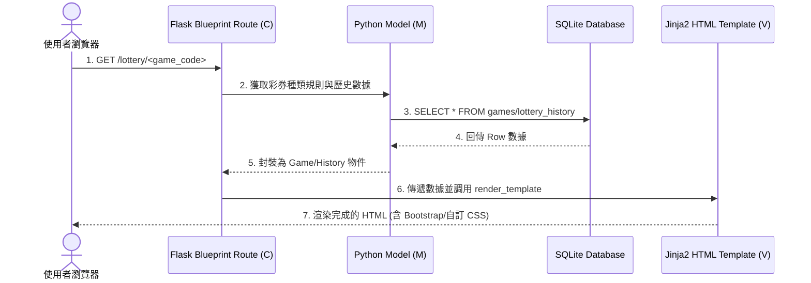
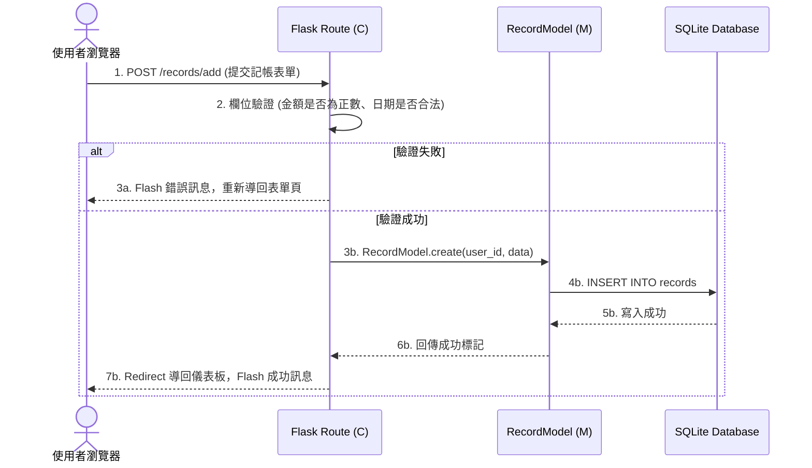

# 系統架構設計 (System Architecture)

> **專案名稱**：運彩分析系統 (Sports Lottery Analysis System)  
> **對應 SDLC 階段**：架構設計 (Architecture Design)  
> **日期**：2026-05-26  

---

## 1. 技術架構說明 (Technical Architecture)

為了確保專案易於學習、快速開發，且完全符合課堂的技術限制，本系統採取了 **單體 MVC 架構 (Monolithic MVC)**。我們**不採用**前後端分離（如 React/Vue API 模式），而是使用傳統的後端渲染（Server-Side Rendering, SSR）。

### 🛠️ 技術選型與原因

* **後端框架：Python + Flask**
  * *原因*：Flask 是一個微型且輕量級的網頁框架，非常適合中小型的學術或課堂專題。它提供靈活的路由配置，學習曲線平緩，能快速建構核心功能。
* **模板引擎：Jinja2**
  * *原因*：Jinja2 是 Flask 預設的模板引擎。它能讓我們直接在 HTML 模板中注入後端變數、進行邏輯判斷（如 `if` 條件與 `for` 迴圈），實作後端直接渲染，免去前端複雜的 state 管理。
* **資料庫：SQLite**
  * *原因*：SQLite 是一個伺服器免安裝、零設定的關聯式資料庫。所有的資料庫內容都儲存在專案目錄下的一個單一檔案（`instance/database.db`）中，非常利於 Git 版本控制與組員之間的代碼共享。
* **前端樣式：Vanilla CSS + Bootstrap 5**
  * *原因*：使用純 CSS 進行自訂義的高質感視覺設計，並搭配 Bootstrap 5 的響應式網格系統（Grid System）與按鈕、表單等 UI 元件，以最少的前端代碼達到最驚艷的視覺效果。

---

## 2. 專案資料夾結構 (Directory Structure)

專案結構嚴格遵循模組化設計（使用 Flask Blueprint 分離路由），使 7 位組員可以在各自負責的檔案中開發，互不干擾：

```text
e04su3su-6/
│
├── app/                        # 應用程式主核心
│   ├── __init__.py             # 初始化 Flask App、資料庫與註冊 Blueprint
│   ├── models/                 # 資料庫模型層 (M) - 負責資料庫查詢與 CRUD
│   │   ├── __init__.py
│   │   ├── game.py             # F-03 彩券種類模型
│   │   ├── history.py          # F-01 歷史中獎數據模型
│   │   └── record.py           # F-04 記帳紀錄模型
│   │
│   ├── routes/                 # 控制器層 (C) - 負責路由、表單處理與業務邏輯
│   │   ├── __init__.py
│   │   ├── lottery.py          # F-03 選擇種類路由
│   │   ├── stats.py            # F-01/F-02 統計與號碼生成路由
│   │   ├── record.py           # F-04 盈虧記帳路由
│   │   └── auth.py             # F-05 使用者認證路由
│   │
│   ├── templates/              # 視圖層 (V) - Jinja2 HTML 模板
│   │   ├── base.html           # 基礎骨架模板 (導航列、Bootstrap 引入)
│   │   ├── auth/
│   │   │   ├── login.html      # 登入頁
│   │   │   └── register.html   # 註冊頁
│   │   └── lottery/
│   │       ├── dashboard.html  # F-03/F-01/F-02 核心數據大盤
│   │       └── records.html    # F-04 記帳管理頁
│   │
│   └── static/                 # 靜態資源檔
│       ├── css/
│       │   └── style.css       # 專案自訂義高質感樣式 (玻璃擬態、暗黑系)
│       └── js/
│           └── main.js         # 前端互動邏輯 (如 AJAX 異步請求)
│
├── database/                   # 資料庫定義與初始化腳本
│   └── schema.sql              # SQLite 建表 SQL 語法
│
├── docs/                       # 軟體生命週期設計文件
│   ├── PRD.md                  # 產品需求文件
│   └── ARCHITECTURE.md         # 系統架構設計文件 (本文件)
│
├── instance/                   # 運行時生成的實例目錄 (Git 忽略，但結構保留)
│   └── database.db             # 實體 SQLite 資料庫檔案
│
├── .env.example                # 環境變數範本檔
├── .gitignore                  # Git 忽略清單 (忽略 .venv, instance/*.db 等)
├── requirements.txt            # Python 依賴包清單
└── app.py                      # 系統主入口點 (Entry Point)
```

---

## 3. 元件關係與資料流圖 (Component Relationships)

### 3.1 頁面渲染流 (Page Rendering Flow)
當使用者在瀏覽器輸入網址或切換彩券種類時，系統的資料流如下：



### 3.2 表單提交與記帳流 (Form Submission & Accounting Flow)
當使用者登入後記錄一筆彩券花費時，系統的資料處理流如下：



---

## 4. 關鍵設計決策 (Key Design Decisions)

1. **基於 Blueprint 的模組化開發**
   * *決策*：將系統切分為 `auth` (註冊登入)、`lottery` (核心彩券種類與大盤)、`stats` (分析預測) 與 `record` (記帳) 等 4 個 Blueprint。
   * *理由*：7 位組員分工開發時，這 4 個模組的檔案與路由完全隔離，能極大程度地避免 Git 衝突，便於最後的功能整合。
2. **純 SQLite 的 `sqlite3.Row` 處理**
   * *決策*：不引入複雜的 SQLAlchemy ORM，而是直接使用 Python 內建的 `sqlite3`，並在建立連線時設置 `conn.row_factory = sqlite3.Row`。
   * *理由*：課堂專題資料表結構單純，使用原生 SQL 能讓學生組員更直觀地理解資料庫原理。`sqlite3.Row` 允許開發者像操作 Python 字典一樣（如 `row['name']`）來取值，大幅簡化了變數渲染代碼。
3. **前端「卡片式」URL 跳轉切換 (F-03)**
   * *決策*：不使用 JavaScript API 切換，而是透過點擊精美卡片直接將 URL 改為 `/lottery/lotto` 或 `/lottery/mark_six`，觸發後端整頁重新渲染。
   * *理由*：這是對 Jinja2 最友善且最穩健的做法。每種彩券都有專屬的 URL，頁面刷新後能精準觸發該彩券對應的 SQL 數據載入，代碼結構清晰，易於 Debug。
4. **統一的 `base.html` 玻璃擬態樣式**
   * *決策*：在 `templates/base.html` 中統一載入 Bootstrap 5 與 `static/css/style.css`。
   * *理由*：確保所有子頁面在繼承 `base.html` 後，自動獲得統一的炫酷暗黑配色與玻璃擬態導航列，各組員撰寫自己負責的子頁面時，不需要重複寫相同的 CSS 樣式。

---

*本系統架構設計文件為本專案的底層技術藍圖。全體組員將在 `app/` 目錄下展開基於本架構的後續實作。*
