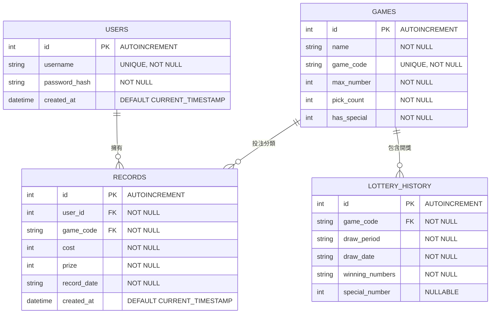

# 資料庫架構與 Model 設計 (Database & Model Design)

> **專案名稱**：運彩分析系統 (Sports Lottery Analysis System)  
> **對應 SDLC 階段**：資料庫設計 (Database Design)  
> **日期**：2026-05-26  

---

## 1. 資料庫實體關係圖 (ERD - Entity Relationship Diagram)

本系統使用 SQLite 作為關聯式資料庫，共設計 4 張實體資料表：
* **`users`**：儲存使用者註冊與認證資料。
* **`games`**：儲存支援的彩券種類及其核心規則參數（大樂透、六合彩、今彩539）。
* **`lottery_history`**：儲存各彩券的開獎期數與中獎號碼，作為 F-01 統計與 F-02 推薦的基礎。
* **`records`**：儲存使用者的投注與中獎盈虧記帳資料，並與 `users` 和 `games` 進行外鍵關聯。



---

## 2. 資料表欄位詳細規格 (Table Specifications)

### 2.1 `users` 表 (使用者)
| 欄位名稱 | SQLite 型別 | 鍵/約束 | 預設值 | 說明 |
| :--- | :--- | :--- | :--- | :--- |
| `id` | INTEGER | PRIMARY KEY AUTOINCREMENT | — | 唯一流水號 |
| `username` | TEXT | UNIQUE, NOT NULL | — | 登入帳號名稱 |
| `password_hash` | TEXT | NOT NULL | — | 經雜湊加密的密碼 |
| `created_at` | DATETIME | NOT NULL | `CURRENT_TIMESTAMP` | 帳號創立時間 |

### 2.2 `games` 表 (彩券種類)
| 欄位名稱 | SQLite 型別 | 鍵/約束 | 預設值 | 說明 |
| :--- | :--- | :--- | :--- | :--- |
| `id` | INTEGER | PRIMARY KEY AUTOINCREMENT | — | 唯一流水號 |
| `name` | TEXT | NOT NULL | — | 彩券中文名稱 |
| `game_code` | TEXT | UNIQUE, NOT NULL | — | 英文唯一標識代碼 |
| `max_number` | INTEGER | NOT NULL | — | 最大可選號碼上限 |
| `pick_count` | INTEGER | NOT NULL | — | 單次投注正碼球數 |
| `has_special` | INTEGER | NOT NULL (0 或 1) | `0` | 是否有特別號球 |

### 2.3 `lottery_history` 表 (歷史開獎數據)
| 欄位名稱 | SQLite 型別 | 鍵/約束 | 預設值 | 說明 |
| :--- | :--- | :--- | :--- | :--- |
| `id` | INTEGER | PRIMARY KEY AUTOINCREMENT | — | 唯一流水號 |
| `game_code` | TEXT | FOREIGN KEY -> `games.game_code` | — | 所屬彩券類型 |
| `draw_period` | TEXT | NOT NULL | — | 開獎期數 |
| `draw_date` | TEXT | NOT NULL | — | 開獎日期 (YYYY-MM-DD) |
| `winning_numbers`| TEXT | NOT NULL | — | 逗號分隔的中獎號碼 (如 `01,12,23`) |
| `special_number` | INTEGER | NULLABLE | — | 特別號數字 (若無則為 NULL) |

### 2.4 `records` 表 (個人記帳紀錄)
| 欄位名稱 | SQLite 型別 | 鍵/約束 | 預設值 | 說明 |
| :--- | :--- | :--- | :--- | :--- |
| `id` | INTEGER | PRIMARY KEY AUTOINCREMENT | — | 唯一流水號 |
| `user_id` | INTEGER | FOREIGN KEY -> `users.id` | — | 投注的使用者外鍵 |
| `game_code` | TEXT | FOREIGN KEY -> `games.game_code` | — | 投注的彩券外鍵 |
| `cost` | INTEGER | NOT NULL | — | 投注花費金額 (必須為正整數) |
| `prize` | INTEGER | NOT NULL | — | 中獎獲得金額 (0 或正整數) |
| `record_date` | TEXT | NOT NULL | — | 投注的日期 (YYYY-MM-DD) |
| `created_at` | DATETIME | NOT NULL | `CURRENT_TIMESTAMP` | 記錄建立時間 |

---

## 3. SQL 建表語法與初始化資料 (database/schema.sql)

我們將在 `database/schema.sql` 中撰寫完整的 SQLite DDL，並在系統啟動時自動初始化這些資料表與預填數據。預填數據將涵蓋：
* 大樂透、六合彩、今彩539 的規則定義；
* 數筆開獎歷史紀錄，便於 F-01 與 F-02 的初期開發與測試。

*(實體 SQL 建表檔將在階段二的專案初始化中，於 `database/schema.sql` 中建立)*

---

## 4. Python Model CRUD 實作規範

全體組員在實作 `app/models/` 下的 Model 檔案時，必須遵守以下統一的 Python 寫作規範，以確保代碼品質與健壯性：

### 4.1 資料庫連線共用方法
每個 Model 檔案都應引用或實作以下連線取得方法，並使用 `sqlite3.Row` 以字典方式取值：
```python
import sqlite3
import os

DATABASE_PATH = os.path.join('instance', 'database.db')

def get_db_connection():
    """取得 SQLite 資料庫連線，並設定 row_factory。"""
    conn = sqlite3.connect(DATABASE_PATH)
    conn.row_factory = sqlite3.Row
    # 啟用 SQLite 外鍵約束支援
    conn.execute("PRAGMA foreign_keys = ON;")
    return conn
```

### 4.2 CRUD 標準模版 (以 F-03 GameModel 為例)
```python
class GameModel:
    @staticmethod
    def get_by_code(game_code):
        """根據英文代碼獲取彩券種類。
        
        Args:
            game_code (str): 彩券識別代碼 (如 'lotto')
            
        Returns:
            sqlite3.Row: 若存在則回傳 Row 物件，否則回傳 None
        """
        conn = get_db_connection()
        try:
            row = conn.execute(
                'SELECT * FROM games WHERE game_code = ?', (game_code,)
            ).fetchone()
            return row
        except sqlite3.Error as e:
            print(f"Database error in get_by_code: {e}")
            return None
        finally:
            conn.close()

    @staticmethod
    def get_all():
        """獲取系統中支援的所有彩券種類。
        
        Returns:
            list[sqlite3.Row]: 彩券種類清單
        """
        conn = get_db_connection()
        try:
            rows = conn.execute('SELECT * FROM games ORDER BY id ASC').fetchall()
            return rows
        except sqlite3.Error as e:
            print(f"Database error in get_all: {e}")
            return []
        finally:
            conn.close()
```

---

*本設計文件將作為 `app/models/` 核心開發與 `database/schema.sql` 設計的最高準則。*
