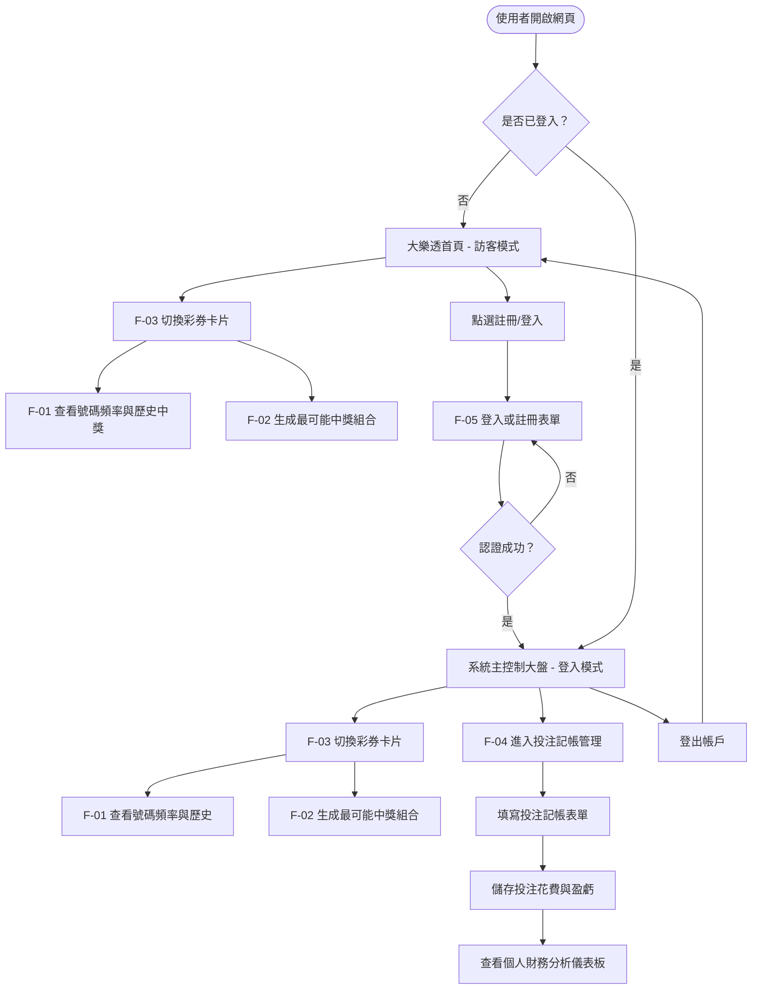
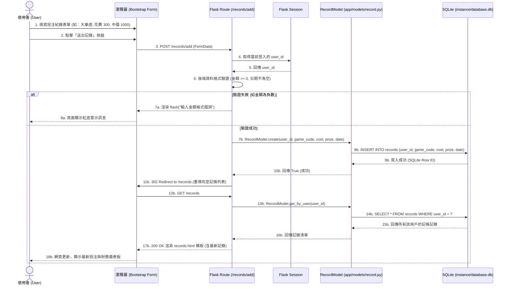

# 系統流程圖與操作路徑設計 (System Flowcharts & Diagrams)

> **專案名稱**：運彩分析系統 (Sports Lottery Analysis System)  
> **對應 SDLC 階段**：系統流程規劃 (System Flow Planning)  
> **日期**：2026-05-26  

---

## 1. 使用者操作流程圖 (User Flow)

以下流程圖展示了使用者在瀏覽網站時，如何切換彩券種類、查看號碼統計、生成預測以及進行個人投注記帳的操作路徑。

---

## 2. 系統資料流序列圖 (System Sequence Diagram)

以下序列圖以 **「使用者在記帳頁面新增一筆投注記錄 (F-04)」** 為例，描述資料如何在前端瀏覽器、Flask 路由控制器、SQLite 資料模型與實體資料庫之間流轉。

---

## 3. 功能路由清單對照表 (Route Mapping Table)

本系統的路由設計嚴格遵循 RESTful 與 Web 表單相容慣例，規劃如下：

| 功能模組 | HTTP 方法 | URL 路由路徑 | 對應 Jinja2 模板 | 負責人 | 說明 |
| :--- | :--- | :--- | :--- | :--- | :--- |
| **首頁重導** | GET | `/` | — (重導向至首頁大盤) | 全組 | 預設重導向至 `/lottery/lotto` |
| **F-03 彩券切換**| GET | `/lottery/<game_code>` | `lottery/dashboard.html` | **蔡宗孟** | 顯示當前選定的彩券大盤、歷史記錄與號碼頻率 |
| **F-01 號碼頻率**| GET | `/lottery/<game_code>/stats`| — (JSON API) | **黃彥閎** | 提供號碼統計圖表的 JSON 數據 API |
| **F-02 生成號碼**| POST | `/lottery/<game_code>/generate`| — (JSON API 或重導) | **廖銘麒** | 根據所選彩券與統計規則生成預測號碼 |
| **F-05 註冊頁面**| GET | `/register` | `auth/register.html` | **李軒睿** | 顯示使用者註冊表單頁面 |
| **F-05 註冊提交**| POST | `/register` | — (處理後重導向) | **李軒睿** | 接收表單、密碼雜湊加密、寫入資料庫 |
| **F-05 登入頁面**| GET | `/login` | `auth/login.html` | **李軒睿** | 顯示使用者登入表單頁面 |
| **F-05 登入提交**| POST | `/login` | — (處理後重導向) | **李軒睿** | 驗證帳號密碼、寫入 Session 狀態 |
| **F-05 使用者登出**| GET/POST | `/logout` | — (重導向至登入頁) | **李軒睿** | 清除 Session 狀態，重導回訪客首頁 |
| **F-04 記帳首頁**| GET | `/records` | `lottery/records.html` | **黃昰傑** | 顯示個人投注記錄列表與盈虧儀表板 |
| **F-04 新增記錄**| POST | `/records/add` | — (處理後重導向) | **黃昰傑** | 接收記帳表單，防越權寫入資料庫 |
| **F-04 刪除記錄**| POST | `/records/<id>/delete`| — (處理後重導向) | **黃昰傑** | 接收 POST 請求，刪除指定記帳記錄 |

---

*本流程設計文件將做為路由骨架程式碼與模板開發的重要依據。*
